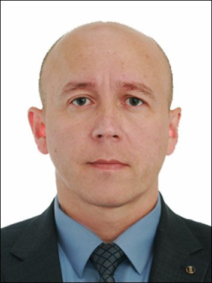

 

# Ефимов Сергей Николаевич

44 года, родился 15 сентября 1979  
Москва, м. Братиславская 

## Контакты:
- +7 (919) 573-67-12
- +7 (922) 573-15-09
- efimovsn@bk.ru — предпочитаемый способ связи

## Образование:
1. 2001 высшее - **Шадринский государственный педагогический институт**, Шадринск  
Физико-математический факультет, Математика (учитель математики и информатики).
2. 2004 высшее - **Современная гуманитарная академия**, Москва  
Юриспруденция, Юриспруденция (бакалавр юриспруденции).
3. 2020 **Частное учреждение дополнительного профессионального образования "Беркут"**.  
   Частный охранник 6 разряда.
4. 2024 курсы повышения квалификации **ООО "НЕТОЛОГИЯ" -  Frontend-разработчик**.

## Опыт работы: 22 года
- Август 2020 — по настоящее время (3 года 6 месяцев)  
Ведомственная охрана ПАО "ГАЗПРОМ" Южно-Уральское межрегионаьное управление охраны. Осуществление охраны и физической защиты объектов ПАО "ГАЗПРОМ".
- Февраль 2023 — июнь 2023 (5 месяцев)  
Специальная военная операция. Специалист - "ландшафтный дизайн".
- Август 2001 — январь 2020 (18 лет 6 месяцев)  
Курганский ЛО МВД России на транспорте
Начальник следственного отделения, старший следователь - проведение предварительного следствия по уголовным делам в сфере незаконного оборота наркотических средств, имущественных преступлений, преступлений против личности и пр., совершенных на ж. д. транспорте.

## Ключевые навыки:
- HTML5, CSS, Адаптивная и мобильная верстка, Node.js, JavaScript, Git- система контроля версий
- Знание языков: Русский — Родной

## Критерии поиска:
- Занятость: полная занятость, частичная занятость, стажировка
- График работы: полный день, сменный график, гибкий график, удаленная работа
